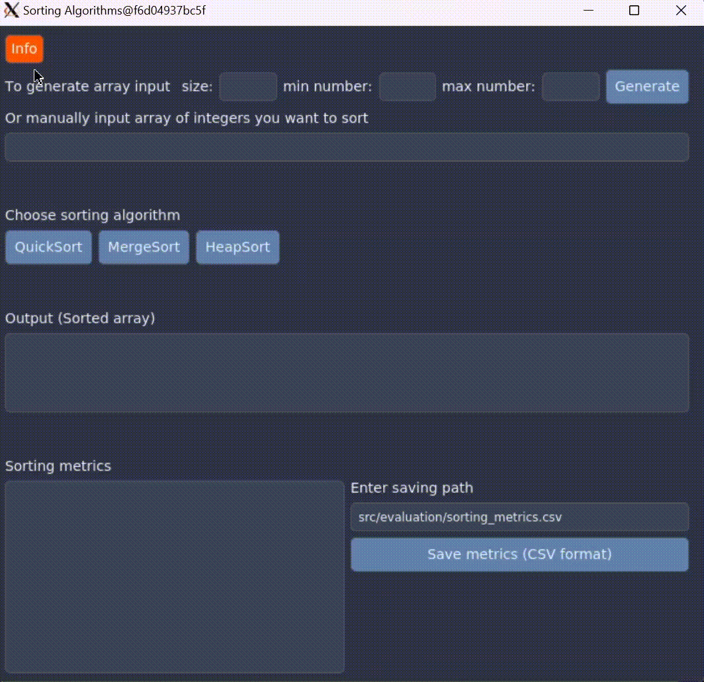

# First Year CS Project - Sorting App (Fast Sorting Algorithms)

1. [Overview](#overview)
2. [Features](#features)
3. [Gallery](#gallery)
4. [Requirements](#requirements)
5. [Setup and Running](#setup-and-running)
6. [Important Notes](#important-notes)
7. [License](#license)

## Overview
This is the project that I did during my first Computer Science academic year.
The goal was to implement fast sorting algorithms such as QuickSort, MergeSort and HeapSort.
For that reason, I've built an application using Qt for the GUI that can be run inside a Docker container.
It allows users to sort integers, see sorted data and sorting metrics.

## Features
- **Sorting algorithms**: Supports QuickSort, MergeSort, and HeapSort.
- **Array input**: Users can manually input arrays or generate random arrays with specified size and range.
- **See metrics**: Displays detailed metrics including array size, number of swaps, memory usage, and sorting time.
- **Save metrics**: Ability to save sorting metrics to a CSV format.

## Gallery
Click 'Info' button to see details how application works.



Example of generation random array, sorting and saving metrics:


# Getting Started

## Requirements

- **Docker**: Follow the instructions on the [Docker website](https://www.docker.com/get-started) to install Docker.
- **VcXsrv** (X Server for Windows): Download and install VcXsrv from [SourceForge](https://sourceforge.net/projects/vcxsrv/).

## Setup and Running

### Step 1: Clone the Repository
```sh
git clone https://github.com/yulianzavodnyk/First-Year-CS-Coursework.git
cd First-Year-CS-Coursework
```

### Step 2: Run VcXsrv:
1. Launch VcXsrv from the Start menu.
2. Configure the display settings:
   1. Multiple windows
   2. Display number: 0
   3. Start no client
   4. Check 'Disable access control'

### Step 3: Configure X Server
Set DISPLAY Environment Variable:
```sh
$env:DISPLAY="host.docker.internal:0.0"
```

### Step 4: Run Docker Engine

### Step 5: Build the Docker Image
```sh
docker build -t first_year_cs_coursework .
```

### Step 6: Run the Docker Container
```sh
docker run -it --rm -e DISPLAY=host.docker.internal:0.0 -v /tmp/.X11-unix:/tmp/.X11-unix first_year_cs_coursework
```
or if you prefer using Docker Compose you can run
```sh
docker-compose up --build
```

## Important Notes
- Ensure VcXsrv is running before starting the Docker container.
- The DISPLAY environment variable and Docker volume for X11 are necessary for GUI display.
- Remember that when you are saving metrics, it will be saved inside docker container.

## License
This project is licensed under MIT License. Check LICENSE for details.
